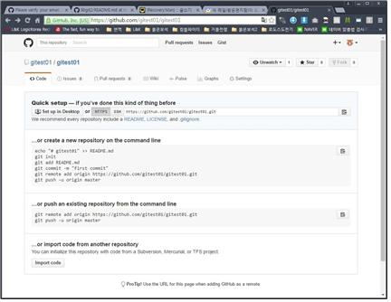

# github 프로젝트 만들어 등록하기
===============================
## 0. git download
<https://desktop.github.com/>

## 1. github 홈페이지를 방문하여 회원가입 진행
* <https://github.com>

## 2. start project

- start project 를 누르고 이메일 인증을 합니다.
- 인증 후 다시 start project를 누릅니다.


## 3. 저장소를 만들기
- 소스 공유가 가능해짐


```
- Owner 는 소유자를 말합니다. 회원가입 할 때 Username 부분에 기입했던 닉네임이 들어가 있음,
- Repository name 는 저장소의 이름을 뜻함.
- Description 은 이 저장소는 무슨 저장소인지 입력하는 부분.
- 기본적으로 'Public'에 체크가 되어 있음. 무료 저장소를 사용.
- Create repository 를 눌러 주시면 저장소가 만들어짐.
```

## 4. 저장소 연결 시키기



```
- 이 창을 잠시 밑으로 내려놓고 다음단계로 넘어갑니다.
```
## 5. 사용자 이름과 메일 주소 입력(경고문고와 임의의 사용자 계정 이름 사용 방지)

```
- 다음 명령어를 git bash 창에 입력합니다.
  $ git config --global user.name "사용자이름"
  $ git config --global user.email 메일주소
```

## 6. 폴더를 만들어주고 등록하기 위한 준비


```
- git bash 창을 켜서 폴더를 만듭니다.
  $ mkdir test
- 폴더로 들어갑니다.
  $ cd test
- 4번 과정에서 나온 사진에서 첫번째를 입력합니다.
  ...or create a new repository on the command line
  echo 어쩌고 저쩌고 등등등
- 명령어 6개를 다 입력하면 끝이 납니다.
```


## 7. 다른 파일이나 폴더 업로드
```
- 폴더 만들기
  $ mkdir 폴더명
- 파일 만들기
  $ nano 파일명

- 폴더에 들어가서 저장소 초기화
  $ git init
- 파일 link 상태 확인
  $ git status
- 파일 추가
  $ git add 파일이름 or $ git add *
- 커밋트
  $ git commit -m master
- 업로드
  $ git push (-u origin master)
```

## 8. 파일 수정 or 추가 후 업로드
```
- 파일 추가
  $ git add 파일이름
- 커밋트
  $ git commit -m master
- 업로드
  $ git push
```

## 출처
<http://recoveryman.tistory.com/251?category=635733>